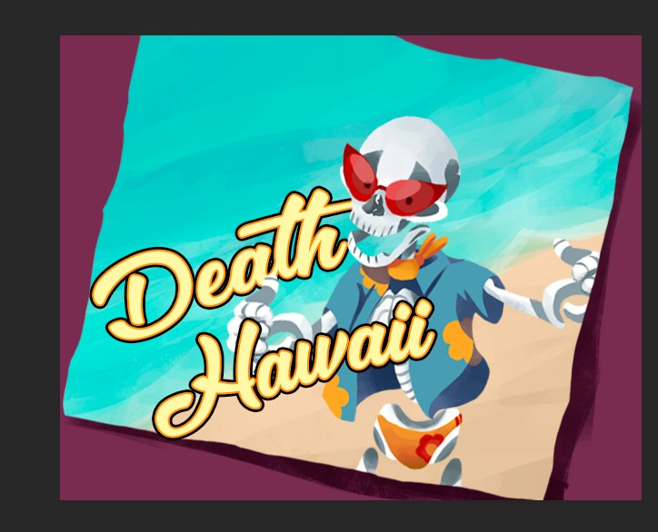
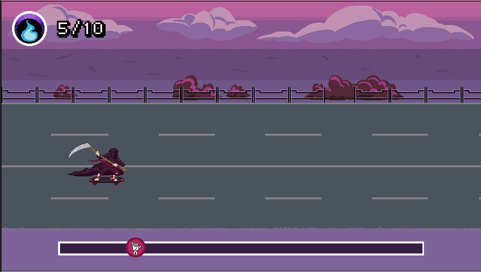

# Death Hawaii: Unity Project




This is a game, where you control a Death/Reaper that want collect souls to exchange by money and go to the Hawaii :)

This game was made with **Unity 2019** during [Ludum Dare 44](https://ldjam.com/events/ludum-dare/44) Game Jam, just in a weekend!

Link: [[Ludum Dare 44] Death Hawaii](https://ldjam.com/events/ludum-dare/44/death-hawaii)

## Versions

- Unity Editor: [`2019.1.0f2`](https://store.unity.com/download?ref=personal)

## Getting Started

1. Clone this repository with all git submodules:

    ```bash
    git clone --recurse-submodules
    ```
    > **Obs:** Verify if the `.wav` files were downloaded in `FMODProject/Assets` folder
2. Or run the `setup.sh` file (or `setup.bat`, if you are using Windows).
3. Open **Unity Editor** and open this project folder.
4. Make sure that `FMODStudioSettings` points to `FMODProject/Death Hawaii.fspro` file.

    > See: [Pointing to a FMOD Studio project file](https://www.fmod.com/resources/documentation-unity?version=2.0&page=user-guide.html#pointing-to-a-fmod-studio-project-file)

5. Play the game and enjoy it! :)


